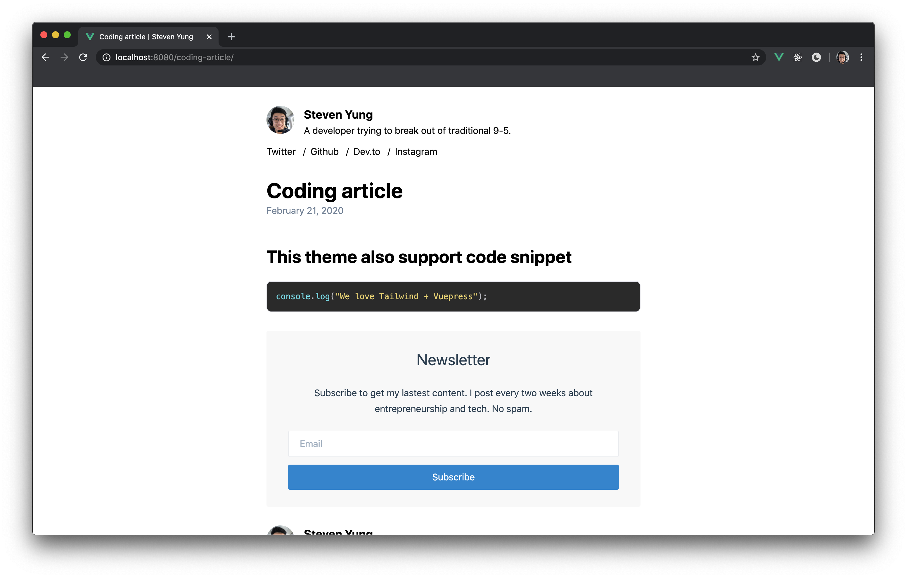

# Guide

## Intro

> A minimalistic blog theme powered by Vuepress and Tailwind.css

This is a ready to use personal blog theme made with Tailwind.css. It's not customizable because of an issue regarding using PostCSS into a Vuepress plugin / theme.

[Read more here about the issue](https://github.com/vuejs/vuepress/issues/2155).

## Getting Started

In this guide, you'll learn how to add this blog theme to a new project manually.

### Installation

```bash
mkdir blog && cd blog # Create an empty directory and go into it

yarn add vuepress @recodable/vuepress-theme-tailwind-blog -D # Install the dependencies
# OR npm install vuepress @recodable/vuepress-theme-tailwind-blog -D
```

### Folder structure

This theme use the official `@vuepress/plugin-blog` under the hood so we recommand to keep the same folder structure as a convention

```bash
├── blog
│   ├── _posts
│   │   ├── 2018-11-7-frontmatter-in-vuepress.md #example
│   │   ├── 2019-2-26-markdown-slot.md #example
│   │   └── 2019-5-6-writing-a-vuepress-theme.md #example
│   └── .vuepress
│       ├── config.js
│       └── `enhanceApp.js` _(**Optional**)_
└── package.json
```

#### Required:

- `blog/.vuepress/config.js`: Entry file of configuration, can also be yml or toml.
- `blog/_posts`: Stores your post content.

#### Optional:

If you wish to configure the files below, you'll need some knowledge of [VuePress](https://vuepress.vuejs.org/).

- `blog/.vuepress/public`: Static resource directory.
- `blog/.vuepress/enhanceApp.js`: App level enhancement.

### Using @recodable/vuepress-theme-tailwind-blog

You must add `@recodable/vuepress-theme-tailwind-blog` as a theme in .vuepress/config.js. `@recodable/vuepress-theme-tailwind-blog` is configurable, but we will use the defaults for now.

```js
// .vuepress/config.js
module.exports = {
  title: "My Vuepress Tailwind Blog", // Title for the site. This will be displayed in the navbar.
  theme: "@recodable/vuepress-theme-tailwind-blog",
  themeConfig: {
    // Please keep looking down to see the available options.
  }
};
```

Add the scripts to `package.json` file:

```json
// package.json
{
  ...
  "scripts": {
    ...
    "dev": "vuepress dev blog", // starts a development server with automatic reload.
    "build": "vuepress build blog" // builds your website.
  }
  ...
}
```

From now on, you can run `yarn dev` or `npm run dev` and head [`localhost:8080`](http://localhost:8080) to see your blog!

### Generating content

The `_posts` folder is where your blog posts live. You can simply write blog posts in Markdown.

All blog post files can begin with front matter. Only `title` and `date` are required, but we recommend you define all frontmatter variables as below. They'll be used to set the corresponding layout. Check out frontmatter for more details. Here's an example:

```markdown
---
title: Article with cover image
date: 2020-02-20
cover:
  url: /magic.jpg
  credit:
    name: Mervyn Chan on Unsplash
    url: https://unsplash.com
---

My content.
```

## Final

Now, Check out your blog at [`localhost:8080`](http://localhost:8080), if everything is ok, you might be interested in the following topics:

- Configure this theme: We'll discuss in the [next section](/config)
- Deploy your blog: Read the [deploy section in VuePress documentation](https://vuepress.vuejs.org/guide/deploy.html)
- Explore deeper:
  - Documentation of [VuePress](https://vuepress.vuejs.org/)
